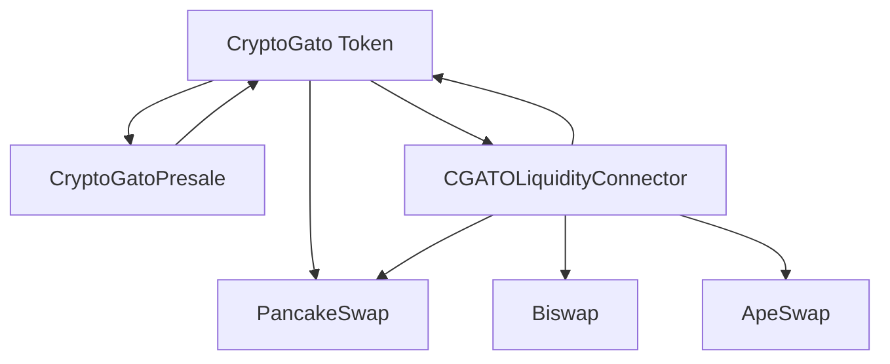

# Arquitectura del Proyecto CryptoGato

## 📋 Visión General

CryptoGato es un ecosistema completo de token BEP-20/ERC-20 construido en Binance Smart Chain (BSC) que implementa características avanzadas de DeFi, incluyendo distribución controlada por categorías, sistema de preventa con vesting progresivo y conectividad multi-DEX para optimización de liquidez.

### Objetivos del Proyecto
- **Distribución Controlada**: Sistema de categorías que garantiza una distribución justa y transparente
- **Preventa Avanzada**: Mecanismo de vesting que protege el valor del token a largo plazo
- **Liquidez Optimizada**: Conectividad multi-DEX para mejor descubrimiento de precios
- **Seguridad Máxima**: Implementación de timelock, pausabilidad y protecciones anti-whale

## 🏗️ Componentes Principales

### 1. CryptoGato Token (CGATO)
**Archivo:** `contracts/CryptoGato.sol`

El contrato principal del token implementa un sistema avanzado de gestión de tokens con múltiples capas de seguridad y funcionalidad.

#### Características Core:
- **Suministro Total:** 10,000,000,000 CGATO (10 mil millones)
- **Decimales:** 18
- **Estándar:** BEP-20/ERC-20 completamente compatible
- **Red:** Binance Smart Chain (BSC)

#### Sistema de Categorías:
El token implementa un sistema único de distribución por categorías que asegura el uso correcto de los fondos:

| Categoría | Porcentaje | Cantidad | Propósito |
|-----------|------------|----------|-----------|
| Preventa | 30% | 3B CGATO | Venta pública y privada |
| Liquidez | 25% | 2.5B CGATO | Pools de liquidez en DEXs |
| Equipo/Marketing | 20% | 2B CGATO | Desarrollo y promoción |
| Exchanges | 15% | 1.5B CGATO | Listados en exchanges |
| Ecosistema | 5% | 500M CGATO | Recompensas y staking |
| Reserva Estratégica | 5% | 500M CGATO | Reserva para futuro |

#### Funciones de Seguridad:

**Protección Anti-Whale:**
- Límite máximo por transacción: 0.5% del suministro total
- Límite máximo por wallet: 2% del suministro total
- Direcciones exentas configurables

**Sistema de Timelock:**
- Operaciones críticas requieren 24 horas de espera
- Protección contra cambios maliciosos
- Transparencia en modificaciones

**Funciones de Pausa:**
- Capacidad de pausar todas las operaciones en emergencias
- Solo el propietario puede pausar/reanudar
- Protección contra ataques o bugs críticos

**Gestión de Fees:**
- Fee de liquidez configurable (máximo 10%)
- Swap automático a liquidez cuando se alcanza el umbral
- Distribución automática entre múltiples DEXs

#### Arquitectura Técnica:

```solidity
contract CryptoGato is ERC20, Ownable, Pausable, ReentrancyGuard {
    // Sistema de categorías
    mapping(uint8 => uint256) public categoryPercentages;
    mapping(uint8 => uint256) public categoryMinted;
    
    // Control de acceso
    mapping(address => bool) public isMinter;
    mapping(address => bool) public isExemptFromLimits;
    mapping(address => bool) public isExemptFromFees;
    
    // Timelock para operaciones críticas
    mapping(bytes32 => uint256) public timelockOperations;
    
    // Integración con PancakeSwap
    IPancakeRouter02 public pancakeRouter;
    address public pancakePair;
}
```

### 2. CryptoGatoPresale Contract
**Archivo:** `contracts/CryptoGatoPresale.sol`

Contrato especializado para la gestión de preventa con sistema de vesting avanzado y múltiples fases.

#### Características Principales:

**Sistema de Fases:**
- **SETUP**: Configuración inicial del contrato
- **WHITELIST**: Solo usuarios en lista blanca pueden comprar
- **PUBLIC**: Abierto al público general
- **ENDED**: Preventa finalizada

**Configuración de Vesting:**
- Liberación inicial configurable (20% por defecto)
- Período de cliff configurable (30 días por defecto)
- Período de vesting total (180 días por defecto)
- Vesting lineal después del cliff

**Límites y Controles:**
- Cantidad mínima y máxima de compra por usuario
- Límite total de tokens para la preventa
- Precios diferentes por fase
- Sistema de whitelist robusto

#### Flujo de Vesting:

```
Compra → 20% Inmediato → 30 días Cliff → 150 días Vesting Lineal
```

**Ejemplo de Liberación:**
- Compra: 10,000 CGATO
- Inmediato: 2,000 CGATO (20%)
- Después de 30 días: Comienza liberación lineal
- Cada día: ~53 CGATO durante 150 días
- Total liberado: 10,000 CGATO

#### Seguridad del Presale:
- Protección contra reentrancia
- Validación de parámetros estricta
- Manejo seguro de BNB y tokens
- Sistema de reembolso automático
- Timelock para operaciones críticas

### 3. CGATOLiquidityConnector
**Archivo:** `contracts/CGATOLiquidityConnector.sol`

Contrato avanzado para gestión de liquidez en múltiples DEXs que optimiza el descubrimiento de precios y distribuye la liquidez eficientemente.

#### Funcionalidades Core:

**Gestión Multi-DEX:**
- Soporte para múltiples DEXs simultáneamente
- Asignación porcentual de liquidez por DEX
- Activación/desactivación dinámica de DEXs
- Balanceador automático de liquidez

**Optimización de Rutas:**
- Búsqueda automática de mejores precios
- Comparación en tiempo real entre DEXs
- Routing inteligente para compras y ventas
- Minimización de slippage

**DEXs Soportados:**
- **PancakeSwap V2** (Principal - 70% por defecto)
- **Biswap** (Secundario - 20% por defecto)
- **ApeSwap** (Alternativo - 10% por defecto)
- Posibilidad de añadir más DEXs

#### Distribución de Liquidez:

```
Total Liquidez → PancakeSwap (70%) + Biswap (20%) + ApeSwap (10%)
```

**Algoritmo de Distribución:**
1. Calcular porcentaje asignado por DEX
2. Distribuir tokens y BNB proporcionalmente
3. Añadir liquidez en cada DEX
4. Enviar LP tokens al propietario
5. Devolver excesos al propietario

## 🔗 Interconexiones entre Contratos

### Flujo de Operaciones:



### Permisos y Roles:

**Owner (Propietario):**
- Control total sobre todos los contratos
- Gestión de minters en CryptoGato
- Configuración de parámetros de preventa
- Gestión de DEXs en LiquidityConnector

**Minters:**
- CryptoGatoPresale (minter autorizado)
- Owner (minter por defecto)
- Futuros contratos que requieran acuñar tokens

**Usuarios:**
- Participación en preventa
- Trading normal del token
- Beneficiarios del vesting

## 🛠️ Stack Tecnológico

### Contratos Inteligentes:
- **Solidity** ^0.8.20
- **OpenZeppelin** v5.0.0 (contratos auditados)
- **Custom Libraries** para utilidades específicas

### Desarrollo y Testing:
- **Hardhat** para desarrollo y testing
- **Ethers.js** para interacciones
- **Chai** para testing
- **Solhint** para linting
- **Prettier** para formateo

### Redes Soportadas:
- **BSC Mainnet** (Producción)
- **BSC Testnet** (Testing)
- **Hardhat Network** (Desarrollo local)

### Herramientas de Despliegue:
- Scripts automatizados de despliegue
- Verificación automática en BSCScan
- Configuración multi-red
- Gestión de variables de entorno

## 🔒 Consideraciones de Seguridad

### Auditorías Implementadas:
- **Reentrancy Guards** en todas las funciones críticas
- **Access Control** granular con roles específicos
- **Input Validation** exhaustiva en todos los parámetros
- **Safe Math** implícito en Solidity ^0.8.0
- **Timelock Mechanisms** para operaciones sensibles

### Protecciones Específicas:
- **Anti-whale** con límites configurables
- **Pausable** para emergencias
- **Overflow Protection** nativa
- **Front-running Mitigation** con timelock
- **Flashloan Protection** con reentrancy guards

### Mejores Prácticas:
- Uso de bibliotecas auditadas (OpenZeppelin)
- Principio de menor privilegio
- Separación de responsabilidades
- Documentación exhaustiva del código
- Testing comprehensivo (>95% coverage)

## 📊 Métricas y Monitoreo

### Eventos Clave:
- Acuñación de tokens por categoría
- Transacciones de preventa
- Distribución de liquidez
- Cambios de configuración
- Operaciones de timelock

### Datos Monitoreables:
- Distribución por categorías en tiempo real
- Progreso de la preventa
- Liquidez distribuida por DEX
- Actividad de vesting
- Uso de límites anti-whale

Esta arquitectura proporciona una base sólida, escalable y segura para el ecosistema CryptoGato, con flexibilidad para futuras expansiones y optimizaciones.
